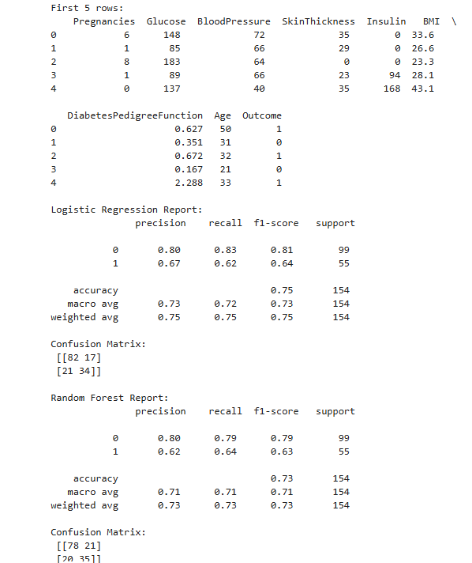
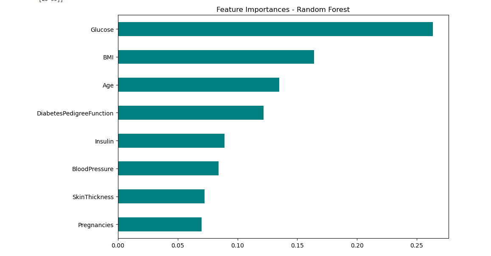
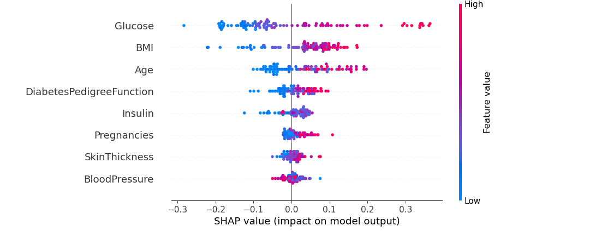
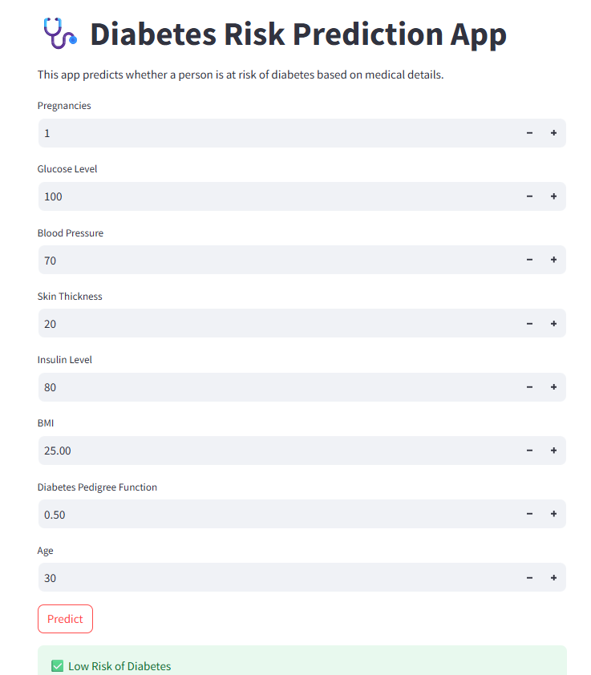
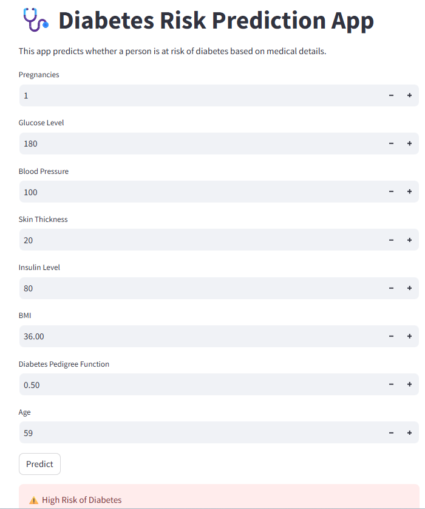

# 🩺 Diabetes Risk Prediction 

Hi! I'm Srilekha, and this project was done as part of the technical task for the AI/ML Developer role at Rx.Now.  
The goal was to build a machine learning model that predicts the risk of a medical condition — I chose **Diabetes** for this task using the well-known PIMA Indian Diabetes dataset.

---

## 🧠 Problem Statement

Build a prototype ML model that predicts the risk of a disease using available medical data.  
This is useful for early detection and risk screening — especially in resource-constrained settings.

---

## 📂 What’s Included

- `rx.ipynb` – Jupyter Notebook with full end-to-end pipeline
- `app.py` – Streamlit code to create a live prediction interface
- `diabetes_model.pkl` & `scaler.pkl` – Saved model and preprocessing pipeline
- SHAP explainability and visualizations
- (This) `README.md` 😉

---

## 🔍 Dataset Used

- **PIMA Indian Diabetes Dataset**
- Publicly available on [Kaggle](https://www.kaggle.com/datasets/uciml/pima-indians-diabetes-database)
- Columns:
  - `Pregnancies`, `Glucose`, `BloodPressure`, `SkinThickness`, `Insulin`
  - `BMI`, `DiabetesPedigreeFunction`, `Age`, `Outcome (0 or 1)`

---

## 🛠 My Approach

### 1. **Data Preprocessing**
- Replaced 0s in columns like Glucose/BP with NaN and imputed using medians
- Feature scaling using `StandardScaler`

### 2. **Model Building**
- Tried both Logistic Regression and Random Forest
- Selected Random Forest for final app due to better accuracy

### 3. **Evaluation**
- Metrics used: Accuracy, Precision, Recall, Confusion Matrix
- Visualized confusion matrix and feature importance

### 4. **Explainability**
- Used **SHAP** to understand feature impact
- Plotted SHAP summary to highlight which features influenced predictions

### 5. **Deployment**
- Built a Streamlit interface where users can input 8 health features
- It returns whether the user is likely at risk of diabetes or not

---
## 📊 Confusion Matrix


## 🎯 Feature Importance


## 🔍 SHAP Summary


## 🖥️ Streamlit Web App UI (High and Low risks)



## 🚀 To Run the Web App

Make sure you have Python + Streamlit installed.

```bash
pip install streamlit joblib
streamlit run app.py```


